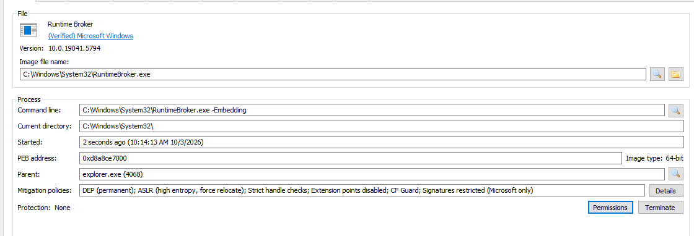

# ppid-spoofing

Spawn processes with a spoofed parent process ID to evade process tree-based detections.

The Maldev Objective of using a second thread attribute was selected to be mitigation policy - Only Microsoft signed DLLs can load into this process.

It was initiated with value - 131079usize.

## Detection Notes

The PPID spoofing against explorer.exe wasn't flagged. Maybe this was due to the fact that there was no payload executed.
