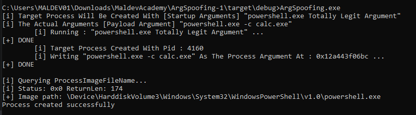

# process-argument-spoofing

Conceal real command-line arguments from process monitoring tools.

# Objective

Research additional information classes supported by 'NtQueryInformationProcess' and implement a query using one of them.

Class 27 = ProcessImageFileNameWin32 was used 

